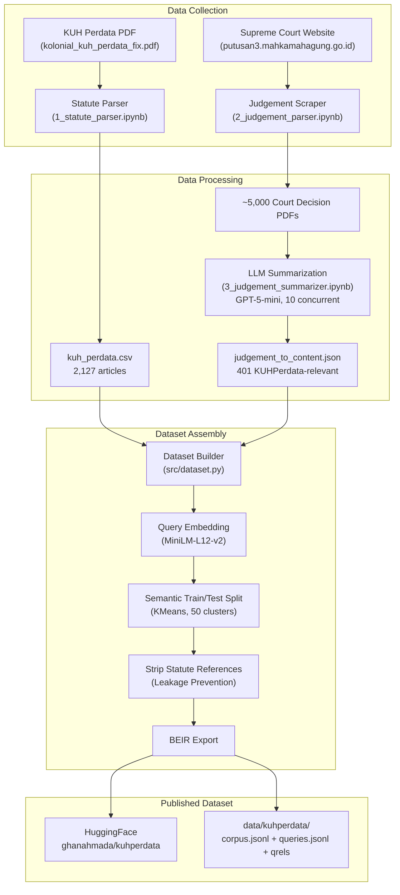
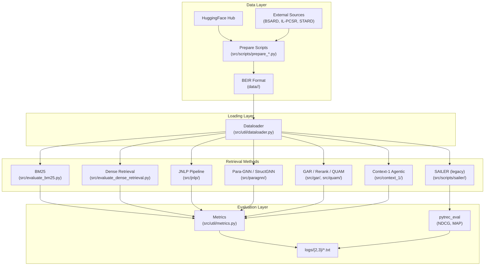
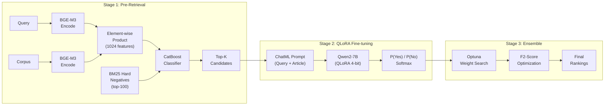

# High Level Design: Multilingual Statute Law Retrieval

| Field | Value |
|-------|-------|
| **Author** | Ghana Ahmada |
| **Repository** | [ghanahmada/kuhperdata](https://huggingface.co/datasets/ghanahmada/kuhperdata) |
| **Version** | 3.0 |
| **Date** | 2026-05-01 |
| **Language** | Python 3.12 |
| **Package Manager** | uv |

---

## 1. Executive Summary

Statute law retrieval — the task of finding relevant legal articles given a natural-language description of a legal situation — remains underserved for non-English languages. While English-centric benchmarks exist (e.g., COLIEE), there is no standardized Indonesian statute retrieval dataset, and cross-lingual comparisons across legal systems are scarce.

This project makes three contributions. **First**, we construct **KUHPerdata**, a novel Indonesian statute law retrieval dataset derived from the *Kitab Undang-Undang Hukum Perdata* (Indonesian Civil Code) and real Supreme Court decisions. It comprises 2,127 statute articles, 1,847 queries (humanized and summarized variants), and relevance judgments in BEIR format, with a scalable ground truth expansion pipeline using LLM-based legal element subsumption analysis. **Second**, we propose **StructGNN**, a paragraph-level graph neural network with structural encoding (act hash + positional features) that improves retrieval by ~460% over BM25 and ~19% over learned baselines (JNLP Stage 1) on KUHPerdata, generalizing across French and Chinese legal datasets without language-specific tuning. **Third**, we design an **agentic retrieval system** (Context-1) that performs multi-turn hybrid search (BM25 + StructGNN) with LLM reasoning for iterative document discovery.

Results show StructGNN achieves MRR@10 = 0.5176 on KUHPerdata-humanized, outperforming all baselines. Para-GNN generalizes strongly across datasets: +24% to +94% over JNLP Stage 1 on KUHPerdata, BSARD, and STARD. The JNLP pipeline is effective but language-dependent — it regresses on IL-PCSR (-68%) and STARD (-20%) due to query length and corpus scale sensitivity.

---

## 2. Research Goals

### 2.1 Novel Dataset Construction — KUHPerdata

Build the first Indonesian statute law retrieval dataset grounded in real court decisions:

- **Corpus**: 2,127 articles from the KUH Perdata (Indonesian Civil Code)
- **Queries**: 1,368 legal incident descriptions extracted from Supreme Court decisions via LLM summarization
- **Relevance Judgments**: 4,372 query–article pairs derived from explicit statute citations in court rulings
- **Format**: BEIR-compatible (corpus.jsonl, queries.jsonl, qrels TSVs)
- **Split**: Semantic train/test split via KMeans clustering to minimize topical leakage
- **Leakage Prevention**: Statute references stripped from query text to prevent trivial lookup

### 2.2 Language-Agnostic SOTA Retrieval

Reproduce and extend state-of-the-art retrieval methods across four multilingual statute law datasets:

1. Establish BM25 baselines across all four languages
2. Evaluate dense retrieval (BGE-M3) as a multilingual baseline
3. Adapt the JNLP COLIEE 2025 pipeline (3-stage hybrid) to all datasets
4. Propose StructGNN — Para-GNN with structural encoding for language-agnostic statute graph features
5. Evaluate graph-based reranking (GAR, QUAM) and BM25+reranker ablations
6. Design agentic retrieval (Context-1) combining hybrid search with LLM reasoning
7. Identify which techniques transfer across languages and which are language-specific

### 2.3 Query Humanization (Done)

Original queries averaged ~1,900 characters (LLM-generated summaries). Two query variants were created via LLM pipeline:

- **Humanized**: Casual first-person queries (~100–200 chars) synthesized by LLM, simulating how non-lawyers describe legal situations
- **Summarized**: LLM-summarized case facts in third-person formal style

Both variants are available as separate datasets (`kuhperdata-humanized`, `kuhperdata-summarized`) with independent qrels and test splits.

**Status**: Complete. See `experiment/vllm_batch_summarizer.py` for the pipeline.

---

## 3. Benchmark Datasets

| Property | KUHPerdata-humanized | KUHPerdata-summarized | BSARD | IL-PCSR | STARD |
|----------|---------------------|----------------------|-------|---------|-------|
| **Language** | Indonesian (id) | Indonesian (id) | French (fr) | English (en) | Chinese (zh) |
| **Legal System** | Civil (Dutch-derived) | Civil (Dutch-derived) | Civil (Belgian) | Common (Indian) | Civil (Chinese) |
| **Corpus Size** | 2,127 | 2,127 | 22,633 | 936 | 55,348 |
| **Queries** | 1,847 | 1,847 | 1,108 | 6,271 | 1,543 |
| **Test Queries** | 383 | 373 | 222 | 1,254 | 308 |
| **Query Style** | Casual first-person | Formal third-person | Legal questions | Case paragraphs | Legal scenarios |
| **Avg Rel/Query** | ~2.2 | ~2.2 | 6.18 | 3.88 | 1.76 |
| **Source** | Constructed (this work) | Constructed (this work) | Louis et al., 2022 | Parikh et al., 2023 | Li et al., 2023 |
| **Prepare Script** | `prepare_kuhperdata.py` | `prepare_kuhperdata.py` | `prepare_bsard.py` | `prepare_ilpcsr.py` | `prepare_stard.py` |

All datasets are normalized to **BEIR format**:

```
data/<dataset>/
├── corpus.jsonl      # {"_id": "doc_id", "title": "", "text": "..."}
├── queries.jsonl     # {"_id": "query_id", "text": "..."}
├── qrels_train.tsv   # query_id  corpus_id  relevance_score
├── qrels_test.tsv
└── dataset_stats.json
```

All data directories are `.gitignore`d and regenerated from source via prepare scripts (see Section 10).

---

## 4. KUHPerdata Dataset Construction Pipeline



### 4.1 Statute Parsing

**Notebook**: `experiment/1_statute_parser.ipynb`

The `KUHPerdataParser` class extracts structured articles from the colonial-era KUH Perdata PDF using PyMuPDF. It handles the hierarchical structure (Buku → Bab → Bagian → Pasal) and outputs `data/statute/kuh_perdata.csv` with columns: `buku_label`, `buku_judul`, `bab_label`, `bab_judul`, `bagian_label`, `bagian_judul`, `pasal_nomor`, `pasal_text`.

**Result**: 2,127 articles extracted.

### 4.2 Judgement Scraping and Parsing

**Notebook**: `experiment/2_judgement_parser.ipynb`

Court decisions are scraped from `putusan3.mahkamahagung.go.id` using `cloudscraper` (anti-bot bypass). HTML listing pages are parsed for PDF download links, and ~5,000 PDFs are bulk-downloaded from PN Bekasi, PN Denpasar, and PN Jakarta courts.

### 4.3 LLM Summarization

**Notebook**: `experiment/3_judgement_summarizer.ipynb`

Each court decision PDF is processed asynchronously (10 concurrent requests) by GPT-5-mini to extract:
1. Legal incidents described in Bahasa Indonesia
2. Relevant law article citations

Results are filtered for KUHPerdata references. Out of ~5,000 decisions: 223 cite KUHPerdata only, 178 cite both KUHPerdata and KUHP, 15 cite KUHP only, and 4,564 cite neither. The 401 KUHPerdata-relevant decisions form the query basis.

**Output**: `data/judgement/judgement_to_content.json`

### 4.4 Semantic Train/Test Split

**Module**: `src/dataset.py` → `semantic_train_test_split()`

Unlike random splitting, we use **semantic splitting** to ensure train and test queries cover different legal topics:

1. Embed all queries with `paraphrase-multilingual-MiniLM-L12-v2`
2. Cluster into 50 groups via KMeans
3. Greedily assign clusters to train or test, maximizing inter-split cosine distance separation
4. Target: 80/20 split → 1,089 train / 279 test queries

**Split statistics** (from `logs/2/dataset_split_metadata.txt`):
- Unique doc IDs in train: 229
- Unique doc IDs in test: 169
- Doc IDs in both splits: 98
- Test judgments pointing to shared docs: 723/861 (84.0%)
- Separation ratio: 1.08×

### 4.5 Data Leakage Prevention

**Module**: `src/scripts/prepare_kuhperdata.py` → `strip_statute_references()`

Since queries are derived from court decisions that explicitly cite statute articles, the raw query text may contain references like "Pasal 1365 KUHPerdata." These references are stripped via regex to prevent trivial keyword lookup, forcing retrieval methods to understand the legal semantics.

### 4.6 BEIR Export and HuggingFace Upload

The final dataset is exported in BEIR format and uploaded to HuggingFace via `src/scripts/push_kuhperdata.py`. The prepare script (`src/scripts/prepare_kuhperdata.py`) downloads from HuggingFace and regenerates local BEIR files, ensuring reproducibility without committing data to git.

---

## 5. System Architecture



### 5.1 Directory Structure

```
TA/
├── data/                          # All datasets in BEIR format (.gitignored)
│   ├── kuhperdata-humanized/      # Primary dataset — casual first-person queries
│   ├── kuhperdata-summarized/     # Formal third-person summarized queries
│   ├── kuhperdata-exp/            # Expanded ground truth (humanized)
│   ├── kuhperdata-summ-exp/       # Expanded ground truth (summarized)
│   ├── bsard/                     # French statute retrieval
│   ├── ilpcsr/                    # English statute retrieval
│   ├── stard/                     # Chinese statute retrieval
│   ├── statute/                   # Raw KUH Perdata PDF + parsed CSV
│   └── judgement/                 # Court decision JSON
├── documentation/                 # Design and planning documents
│   ├── HLD.md                     # This document
│   ├── benchmark-implementation-guide.md
│   ├── EVAL-Baseline-Results.md   # All evaluation results
│   ├── EVAL-ParaGNN.md            # Para-GNN detailed results
│   ├── EVAL-StructGNN.md          # StructGNN detailed results
│   ├── PIPELINE-QrelsExpansion.md # Ground truth expansion methodology
│   └── PLANNING-*.md             # Various planning documents
├── experiment/                    # Jupyter notebooks + data collection
│   ├── 1_statute_parser.ipynb
│   ├── 2_judgement_parser.ipynb
│   ├── 3_judgement_summarizer.ipynb
│   ├── 3b_vllm_judgement_summarizer.ipynb
│   ├── 4-7_*_dataset.ipynb        # External dataset preparation
│   ├── vllm_batch_summarizer.py   # Query humanization/summarization pipeline
│   ├── annotate_subsumption.py    # Ground truth expansion annotation
│   ├── judgement_scraper.py
│   └── claude-assistance/         # Auxiliary scraping scripts
├── src/
│   ├── dataset.py                 # KUHPerdata dataset builder
│   ├── evaluate_bm25.py           # BM25 evaluation
│   ├── evaluate_dense_retrieval.py # BGE-M3 cosine similarity
│   ├── evaluate_jnlp.py           # JNLP pipeline entry point
│   ├── evaluate_paragnn.py        # Para-GNN / StructGNN evaluation
│   ├── evaluate_gar.py            # Graph Adaptive Reranking
│   ├── evaluate_rerank.py         # BM25 + Reranker ablation
│   ├── evaluate_quam.py           # QUAM evaluation
│   ├── analysis_bm25_errors.py    # BM25 error analysis
│   ├── analysis_structgnn_errors.py # StructGNN error analysis
│   ├── context_1/                 # Agentic retrieval system
│   │   ├── agent.py               # AgenticRetriever (observe-reason-act loop)
│   │   ├── evaluate_context1.py   # Async evaluation harness
│   │   ├── hybrid_search.py       # BM25 + Dense + RRF fusion
│   │   ├── prompts.py             # LLM system prompt + tool definitions
│   │   ├── token_budget.py        # Token budget management
│   │   └── tools.py               # ToolExecutor (search, grep, read, prune)
│   ├── paragnn/                   # Paragraph-level GNN
│   │   ├── __init__.py            # ParaGNNConfig, DATASETS
│   │   ├── model.py               # GNN model
│   │   ├── eugat.py               # Edge-Updated Graph Attention Network
│   │   ├── graph_builder.py       # Query-document graph construction
│   │   ├── structure.py           # Structural features (act hash, positional)
│   │   ├── dataset.py             # GNN dataset/dataloader
│   │   ├── precompute.py          # BGE-M3 embedding precomputation
│   │   └── trainer.py             # Training loop with alpha grid search
│   ├── jnlp/                      # JNLP 3-stage pipeline
│   │   ├── __init__.py            # Config dataclass
│   │   ├── pipeline.py            # PipelineOrchestrator
│   │   ├── stage1_retriever.py    # BGE-M3 + CatBoost
│   │   ├── stage2_finetuner.py    # QLoRA Qwen fine-tuning
│   │   └── stage3_ensemble.py     # Optuna weighted ensemble
│   ├── gar/                       # Graph Adaptive Reranking
│   │   ├── adaptive_reranker.py   # GAR reranker
│   │   └── corpus_graph.py        # Corpus graph construction
│   ├── quam/                      # QUAM (SetAff variant)
│   │   └── adaptive_reranker.py   # SetAff update rule
│   ├── data/                      # Ground truth expansion
│   │   ├── expand_qrels.py        # LLM subsumption judgment pipeline
│   │   └── RUBRIK-PERDATA.md      # Legal element analysis rubric
│   ├── inference/                 # Model export and demo
│   │   ├── export_hf.py           # Export to HuggingFace
│   │   ├── import_hf.py           # Import from HuggingFace
│   │   ├── infer_paragnn.py       # Para-GNN inference
│   │   └── prepare_demo_data.py   # Demo data preparation
│   ├── analysis/                  # Bias and distribution analysis
│   │   ├── diagnose_hub_bias.py   # Hub article bias analysis
│   │   └── training_distribution.py
│   ├── scripts/
│   │   ├── prepare_kuhperdata.py  # Download + BEIR conversion
│   │   ├── prepare_bsard.py
│   │   ├── prepare_ilpcsr.py
│   │   ├── prepare_stard.py
│   │   ├── push_kuhperdata.py     # Upload to HuggingFace
│   │   ├── run_evaluate_multilingual.sh
│   │   └── sailer/                # SAILER fine-tuning + evaluation (legacy)
│   └── util/
│       ├── bm25.py                # Custom BM25 implementation
│       ├── compat.py              # Compatibility utilities
│       ├── dataloader.py          # BEIR format loader
│       └── metrics.py             # MRR, Recall, Precision, Hit Rate
├── logs/                          # Evaluation results
├── outputs/                       # Model outputs (.gitignored)
├── setup_vm.sh                    # GPU VM one-time setup
├── requirements.txt               # Full dependencies
└── pyproject.toml                 # Project configuration
```

**Sibling directory**: `../SAILER/` — Full SAILER repository (legacy, converted from git submodule).

### 5.2 Key Design Decisions

| Decision | Rationale |
|----------|-----------|
| **BEIR format for all datasets** | Standard IR evaluation format; enables uniform data loading and cross-dataset comparison |
| **Semantic train/test split** | Prevents topical leakage between splits; more realistic evaluation than random split |
| **All data regenerable from scripts** | Data directories are `.gitignored`; `setup_vm.sh` regenerates everything from source |
| **Separate prepare scripts per dataset** | Each external dataset has unique source format; isolation simplifies debugging |
| **JNLP as primary methodology** | Winner of COLIEE 2025; designed for multilingual legal IR; 3-stage design allows ablation |
| **Product features over histogram** | Element-wise product preserves embedding geometry better than binned L1 histograms |
| **BM25 hard negatives** | More informative than random negatives; teaches classifier to distinguish hard cases |
| **Strip statute references** | Prevents data leakage from explicit article citations in court decision text |
| **Dual virtual environments** | SAILER requires Python 3.10; JNLP requires Python 3.12 — separate venvs avoid conflicts |
| **SAILER as plain code** | Converted from git submodule for easier modification (vocab extension, custom fine-tuning) |

---

## 6. Retrieval Methods

### 6.1 BM25 Baseline

**Files**: `src/util/bm25.py`, `src/evaluate_bm25.py`

Custom BM25 implementation built on scikit-learn's `TfidfVectorizer`:

- Parameters: b=0.7, k1=1.6 (tuned from defaults b=0.75, k1=1.5)
- Supports configurable n-gram range
- Chinese tokenization via `jieba` word segmentation
- Evaluated across all 4 datasets with `--dataset` flag

**CLI**:
```bash
python src/evaluate_bm25.py --dataset kuhperdata --top_k 10 --split test
python src/evaluate_bm25.py --dataset stard --top_k 10  # auto jieba for Chinese
```

### 6.2 Dense Retrieval (BGE-M3)

**File**: `src/evaluate_dense_retrieval.py`

Proof-of-concept dense retrieval using `BAAI/bge-m3`:

- Encodes queries and corpus with `BGEM3FlagModel` (1024-dim dense embeddings)
- Cosine similarity scoring
- Evaluates at K = 10, 50, 100
- Includes score distribution analysis and separability index

This serves as both a baseline and the embedding backbone for the JNLP pipeline.

### 6.3 JNLP Pipeline

**Package**: `src/jnlp/`

Adapted from: *"JNLP at COLIEE 2025: Hybrid Large Language Model-based Framework for Legal Information Retrieval and Entailment"*



#### 6.3.1 Stage 1 — BGE-M3 + CatBoost Pre-Retriever

**File**: `src/jnlp/stage1_retriever.py` (579 lines)

Trains a CatBoost binary classifier on query-document pair features:

| Component | Original JNLP Paper | Our Adaptation |
|-----------|---------------------|----------------|
| **Embeddings** | BGE-M3 (1024-dim) | Same |
| **Features** | L1 histogram (76 bins) | Element-wise product (1024 features) |
| **Histogram Range** | Fixed [0, 2] | Calibrated from data |
| **Negatives** | Random | BM25 top-100 hard negatives |
| **Oversampling** | 300× | 10× (sufficient with hard negatives) |
| **Re-ranker** | BGE-reranker-v2-m3 | Optional (BGE-reranker or RankLLaMA) |

**Training Details**:
- Positive pairs: query → relevant articles (from qrels_train)
- Negative pairs: BM25 top-100 per query, excluding positives
- 10× oversampling of positives to balance classes
- CatBoost: 1,000 iterations, GPU-accelerated (~88 seconds)
- Embeddings cached to disk for reuse

#### 6.3.2 Stage 2 — QLoRA Fine-tuned LLM

**File**: `src/jnlp/stage2_finetuner.py`

Binary relevance classification via fine-tuned LLM:

- **Base Models**: Qwen2-7B-Instruct, Qwen2.5-7B-Instruct (default), Qwen3-8B, Qwen3.5-4B
- **Quantization**: 4-bit via Unsloth `FastLanguageModel`
- **LoRA Config**: r=16, alpha=32, target modules: q/k/v/o/gate/up/down projections
- **Prompt Format**: ChatML with system="Legal expert", user="Query: {q}\nArticle: {a}", assistant="Yes"/"No"
- **Hard Negative Mining**: Per query, 4 hard negatives (Stage 1 ranks 1–14) + 1 random negative (ranks 50–99)
- **Training**: 3× positive upsampling, batch_size=8, grad_accum=2 (effective 16), max_seq_length=1536, 1 epoch, lr=2e-4 (cosine)
- **Inference**: Softmax over Yes/No token logits → relevance probability
- **Training time**: ~2h 19m for 988 steps on KUHPerdata (8.47s/step)
- **Inference time**: ~77 min for 279 test queries

#### 6.3.3 Stage 3 — Optuna Weighted Ensemble

**File**: `src/jnlp/stage3_ensemble.py` (233 lines)

Combines multiple Stage 2 model outputs via weighted voting:

- Optuna searches for optimal weights across model predictions
- Optimizes F-beta score with beta=2 (recall-biased, appropriate for legal retrieval)
- Supports arbitrary number of Stage 2 models (different LLMs or checkpoints)

#### 6.3.4 Pipeline Orchestration

**File**: `src/jnlp/pipeline.py` (680 lines)

Key orchestration features:
- `evaluate_stage1_only()` — fast evaluation without LLM inference
- `evaluate_stage2_only()` — full Stage 1+2 with auto-training
- `run_full_pipeline()` — end-to-end training + evaluation
- Smart GPU memory management: Stage 1 models freed before loading Stage 2 LLM
- Embedding caching to disk for repeated evaluations

**CLI**:
```bash
python src/evaluate_jnlp.py --dataset kuhperdata --stage 1 --feature_type product
python src/evaluate_jnlp.py --dataset kuhperdata --stage 2 --llm_model Qwen/Qwen2-7B-Instruct
```

### 6.4 SAILER

**Directory**: `src/scripts/sailer/`

SAILER (Structure-Aware pre-trained language model for legal text retrieval) is evaluated as an alternative dense retrieval approach.

**Pipeline**:
1. `build_finetune_data.py` — Converts KUHPerdata to SAILER format with BM25 hard negatives (30 per query via `rank_bm25.BM25Okapi`)
2. `extend_vocab.py` — Extends SAILER_en tokenizer with 2,232 Indonesian tokens (mean subword initialization)
3. `run_finetune.sh` — Fine-tunes `CSHaitao/SAILER_en` with: q_max_len=512, p_max_len=256, batch_size=4, lr=5e-6, 3 epochs
4. `build_encode_data.py` — Converts corpus and queries to SAILER encoding format
5. `run_encode.sh` — Encodes all texts with fine-tuned model → pickle embeddings
6. `evaluate_retrieval.py` — FAISS IndexFlatIP retrieval (L2-normalized cosine) with `pytrec_eval` metrics (NDCG@10, Recall@10, MAP)

**Results** (KUHPerdata, source: `logs/3/sailer_comparison.txt`):

| Model | NDCG@10 | Recall@10 | MAP | MRR@10 |
|-------|---------|-----------|-----|--------|
| SAILER_en (zero-shot) | ~0.001 | ~0.001 | ~0.001 | ~0.001 |
| SAILER_en + vocab ext. + fine-tune | 0.0045 | 0.0058 | 0.0036 | 0.0104 |
| multilingual-e5-base (fine-tuned) | **0.1490** | **0.2660** | **0.1123** | **0.1603** |

**Conclusion**: SAILER_en is unsuitable for non-English statute retrieval. Vocabulary extension alone cannot overcome English-only pre-training weights. Multilingual-e5-base outperforms by **33×** (NDCG@10: 0.149 vs. 0.0045), confirming that multilingual pre-training is essential for cross-lingual legal IR.

### 6.5 Para-GNN

**Package**: `src/paragnn/`

Adapted from IL-PCSR (Paul et al., EMNLP 2025). Builds a graph per query-document pair:

- **Document nodes**: query + statute candidates (embedding = mean of paragraph embeddings)
- **Paragraph nodes**: per-sentence embeddings (BGE-M3, 1024d)
- **Edges**: paragraph → parent document, with rhetorical role embedding as edge feature
- **GNN**: 2-layer Edge-Updated Graph Attention Network (EUGAT)
- **Scoring**: `alpha × GNN_score + (1-alpha) × BM25_score` with post-training alpha grid search

Two method variants:
- **Adapted**: query as single paragraph (no LLM needed) — default
- **Full**: query split into sentences, each labeled with rhetorical role by LLM

Key engineering improvements over IL-PCSR:
1. **Post-training alpha grid search** — decouples GNN quality from BM25 blend ratio
2. **Early stopping** (patience=10) — prevents overfitting
3. **BGE-M3 embeddings** — replaces original encoders for multilingual support

### 6.6 StructGNN

**Package**: `src/paragnn/` (structure_mode=structural)

StructGNN extends Para-GNN with **structural node features** as a language-agnostic alternative to proximity edges:

- **Act hash** (`act_dim`): deterministic hash vector identifying which legal instrument (act/code) an article belongs to — enables the GNN to distinguish articles from different statutes in multi-act corpora like BSARD
- **Positional encoding** (`pos_dim`): sinusoidal encoding of normalized sequential position within the act (index / total articles)

These features are language-agnostic: for multi-act datasets (BSARD, STARD), the act hash differentiates statutes; for single-act datasets (KUHPerdata), positional encoding captures sequential proximity between articles.

**CLI**:
```bash
python src/evaluate_paragnn.py --dataset kuhperdata-humanized --structure_mode structural
```

### 6.7 GAR (Graph-based Adaptive Re-ranking)

**Package**: `src/gar/`

Builds a corpus similarity graph and iteratively expands the retrieval set by following edges from high-scoring documents. Uses MonoT5, mT5, or BGE cross-encoder as scorer.

**CLI**:
```bash
python src/evaluate_gar.py --dataset kuhperdata-humanized --scorer bge
```

### 6.8 Rerank (BM25 + Reranker Ablation)

**File**: `src/evaluate_rerank.py`

Ablation isolating the reranker contribution: BM25 top-N → reranker re-scores all N → re-sort. No graph expansion. Compares with GAR to measure graph expansion value.

### 6.9 QUAM

**Package**: `src/quam/`

QUAM uses a SetAff (Set Affinity) update rule instead of GAR's simple max for graph frontier expansion. The `top_s` parameter controls frontier expansion aggressiveness.

### 6.10 Context-1 (Agentic Retrieval)

**Package**: `src/context_1/`

An agentic retrieval system where an LLM performs multi-turn reasoning with tool calls:

1. **Observe**: LLM receives query + current document set
2. **Reason**: LLM identifies gaps in coverage, formulates search strategies
3. **Act**: LLM calls tools (search_corpus, grep_corpus, read_document, prune_chunks)
4. **Repeat**: Up to 10 turns with token budget management

**Architecture**:
- **Hybrid search**: BM25 + BGE-M3 dense retrieval with RRF fusion (k=60)
- **Optional cross-encoder reranking**: BGE-reranker-v2-m3
- **Token budget**: Limits total context to prevent runaway costs
- **Resumable**: Results streamed to `agent_log.jsonl` per query

**CLI**:
```bash
python src/context_1/evaluate_context1.py --dataset kuhperdata-humanized \
  --base_url http://127.0.0.1:8000/v1 --model qwen3.6-27b --concurrency 4
```

---

## 7. Ground Truth Expansion Pipeline

**Files**: `src/data/expand_qrels.py`, `src/data/RUBRIK-PERDATA.md`

The original KUHPerdata dataset has sparse ground truth (~2.2 relevant articles per query). We use LLM-based legal element subsumption analysis to expand relevance judgments.

**Method** (adapted from Rubrik Pidana → Rubrik Perdata):
1. For each query, retrieve BM25 top-50 candidate articles (excluding existing ground truth)
2. LLM performs *unsur analysis* per article: identify core legal elements, check if each is discussed in the case facts
3. An article is **RELEVAN** if all core elements are discussed (even if the court rejected the claim)
4. An article is **TIDAK RELEVAN** if core elements are absent or the legal domain doesn't match

**Implementation**: Qwen 3.6 27B AWQ via vLLM, 16-24 concurrent queries, streamed to `expansion_log.jsonl` for resumability.

**Documentation**: See `documentation/PIPELINE-QrelsExpansion.md` for full methodology, worked examples, and rubric design.

---

## 8. Evaluation Framework

### 8.1 Metrics

| Metric | Description | Implementation |
|--------|-------------|----------------|
| **MRR@K** | Mean Reciprocal Rank at K | `src/util/metrics.py` |
| **Recall@K** | Fraction of relevant docs retrieved in top-K | `src/util/metrics.py` |
| **Precision@K** | Fraction of top-K docs that are relevant | `src/util/metrics.py` |
| **Hit Rate** | Fraction of queries with ≥1 relevant doc in top-K | `src/util/metrics.py` |
| **NDCG@10** | Normalized Discounted Cumulative Gain | `pytrec_eval` (SAILER legacy) |
| **MAP** | Mean Average Precision | `pytrec_eval` (SAILER legacy) |
| **F2-Score** | F-beta with beta=2 (recall-biased) | `src/jnlp/stage3_ensemble.py` |

### 8.2 KUHPerdata Method Comparison (Humanized, test split, max_relevant=5)

| Method | MRR@10 | Recall@10 | Hit Rate |
|--------|--------|-----------|----------|
| BM25 (stemmer+stopwords) | 0.0601 | 0.1032 | 14.6% |
| Dense (BGE-M3) | 0.0926 | 0.1451 | 20.4% |
| JNLP Stage 1 | 0.4356 | 0.6024 | 71.8% |
| Para-GNN (base, alpha=0.8) | 0.4857 | 0.5375 | 70.2% |
| **StructGNN (alpha=0.9)** | **0.5176** | **0.6213** | **77.3%** |

### 8.3 Cross-Dataset Results

#### BM25 (source: `logs/2/bm25.txt`)

| Dataset | Lang | MRR@10 | Recall@10 | Hit Rate |
|---------|------|--------|-----------|----------|
| KUHPerdata | id | 0.1467 | 0.0858 | 24.1% |
| BSARD | fr | 0.2488 | 0.2664 | 42.3% |
| IL-PCSR | en | 0.1558 | 0.1017 | 25.0% |
| STARD | zh | 0.3382 | 0.4272 | 53.3% |

#### JNLP Stage 1 (source: `logs/3/jnlp_stage1.txt`)

| Dataset | Lang | MRR@10 | Recall@10 | Hit Rate | vs BM25 |
|---------|------|--------|-----------|----------|---------|
| KUHPerdata | id | 0.3997 | 0.3939 | 62.0% | +173% |
| BSARD | fr | 0.3284 | 0.3047 | 44.6% | +32% |
| IL-PCSR | en | 0.0493 | 0.0323 | 12.9% | -68% |
| STARD | zh | 0.2705 | 0.3895 | 49.4% | -20% |

#### Para-GNN (source: `documentation/EVAL-ParaGNN.md`)

| Dataset | Lang | MRR@10 | Recall@10 | Hit Rate | Alpha | vs JNLP S1 |
|---------|------|--------|-----------|----------|-------|-------------|
| KUHPerdata-humanized | id | 0.456 | 0.542 | 67.8% | 0.9 | +24% |
| KUHPerdata-summarized | id | 0.458 | 0.522 | 71.1% | 0.8 | +36% |
| BSARD | fr | 0.493 | 0.487 | 68.5% | 0.7 | +50% |
| STARD | zh | 0.527 | 0.617 | 72.4% | 0.8 | +94% |

#### GAR (source: `logs/3/gar.txt`)

| Dataset | Lang | MRR@10 | Recall@10 | Hit Rate |
|---------|------|--------|-----------|----------|
| KUHPerdata | id | 0.1909 | 0.2450 | 37.3% |
| BSARD | fr | 0.1938 | 0.2058 | 36.5% |
| IL-PCSR | en | 0.1558 | 0.1017 | 25.0% |
| STARD | zh | 0.3728 | 0.4562 | 55.2% |

### 8.4 Evaluation Protocol

| Protocol | Detail |
|----------|--------|
| **Evaluation split** | Test only (no validation on test during development) |
| **Split method** | Semantic (KMeans clustering), not random |
| **Leakage prevention** | Statute references stripped from queries |
| **Random seed** | 42 (fixed for reproducibility) |
| **Metrics computed** | Per-query, then averaged (macro) |
| **max_relevant** | 5 (queries with >5 relevant docs filtered out) |

---

## 9. Research Findings and Open Questions

### 9.1 BM25 Struggles with Legal Text

BM25 achieves only MRR@10 = 0.06 on KUHPerdata-humanized. Legal statutes use formal, archaic language that diverges significantly from casual first-person queries. Summarized queries perform better (0.09) due to more formal vocabulary.

### 9.2 Dense Retrieval Marginal Over BM25

Raw BGE-M3 cosine retrieval improves only marginally over BM25 on KUHPerdata (+0.03 MRR). The separability index of 0.50 suggests embeddings alone cannot distinguish relevant from non-relevant pairs.

### 9.3 JNLP Stage 1: Effective but Language-Dependent

The CatBoost classifier over product features achieves MRR@10 = 0.44 on KUHPerdata-humanized, a significant improvement over BM25. However, cross-dataset evaluation reveals this is **not universal**:

- **Works well**: KUHPerdata (+173% vs BM25), BSARD (+32%)
- **Regresses**: IL-PCSR (-68%), STARD (-20%)

This suggests element-wise product features and BM25 hard negatives are most effective when: (a) queries are moderate length, (b) corpus is small-to-medium, and (c) BGE-M3 embeddings have sufficient separability. When queries are extremely long (IL-PCSR) or the corpus is very large (STARD), the approach breaks down.

### 9.4 Para-GNN Generalizes, StructGNN Leads

Para-GNN with post-training alpha grid search consistently outperforms JNLP Stage 1 across all tested datasets (+24% to +94%). StructGNN adds structural features that further improve performance on KUHPerdata (MRR: 0.4857 → 0.5176) and reduce hub bias (debiased MRR drops less: 0.2272 vs 0.1881).

### 9.5 Hub Bias in Graph Methods

Para-GNN exhibits hub bias — frequently-cited articles like Pasal 1365 (PMH) achieve high scores regardless of actual relevance. Debiased MRR drops from 0.4857 → 0.1881 (humanized). StructGNN's positional encoding partially mitigates this (0.5176 → 0.2272).

### 9.6 SAILER Fails Cross-Lingually

SAILER_en with vocabulary extension and fine-tuning achieves only NDCG@10 = 0.0045 on KUHPerdata — **33× worse** than multilingual-e5-base. Multilingual pre-training (not just tokenization) is essential.

### 9.7 Answered Questions

| Question | Answer |
|----------|--------|
| Does Stage 1 transfer across datasets? | Partially — works on KUHPerdata and BSARD, regresses on IL-PCSR and STARD |
| Can Stage 2 improve Stage 1? | Yes, +5.4% Recall@10 on KUHPerdata (minor MRR trade-off) |
| Does SAILER complement BGE-M3? | No — unsuitable for non-English legal text |
| Does Para-GNN generalize? | Yes — +24% to +94% over JNLP S1 across ID, FR, ZH datasets |
| Does StructGNN reduce hub bias? | Partially — debiased scores drop less than base Para-GNN |
| Does query humanization change which methods are best? | BM25/Dense degrade more with casual queries; GNN methods are more robust |

### 9.8 Open Questions

- **StructGNN cross-dataset**: Run StructGNN on BSARD, IL-PCSR, STARD
- **Expanded ground truth evaluation**: Re-run all methods on expanded qrels (kuhperdata-exp, kuhperdata-summ-exp)
- **Context-1 full evaluation**: Run agentic retrieval on all datasets
- **Exhaustive judgment**: All 2127 articles per query for complete qrels (zero pooling bias)

---

## 10. Infrastructure and Reproducibility

### 10.1 Environment

| Component | Version/Tool |
|-----------|-------------|
| **Python** | 3.12 |
| **Package Manager** | uv |
| **GPU (VM)** | NVIDIA RTX PRO 5000 Blackwell (sm_120) |
| **Torch** | 2.7.0+cu128 |
| **DGL** | 2.4+cu124 (compatible with torch 2.7 despite version warning) |
| **vLLM** | 0.20.0 (for ground truth expansion + agentic retrieval) |
| **GPU Setup** | `setup_vm.sh` (one-time VM provisioning) |
| **Random Seed** | 42 |

### 10.2 Key Dependencies

| Category | Packages |
|----------|----------|
| **Data Processing** | PyMuPDF, pandas, beautifulsoup4, cloudscraper, tqdm |
| **LLM APIs** | openai, vllm |
| **ML Core** | scikit-learn, jieba, datasets |
| **JNLP Pipeline** | torch, transformers, sentence-transformers, accelerate, peft, bitsandbytes, FlagEmbedding, catboost, imbalanced-learn, optuna |
| **Para-GNN** | torch, dgl, FlagEmbedding |
| **Unsloth** | unsloth (QLoRA 4-bit quantization) |
| **SAILER (legacy)** | rank-bm25, pytrec-eval-terrier, faiss |

### 10.3 VM Setup and Data Regeneration

The `setup_vm.sh` script performs complete environment setup:

1. Creates virtual environment (Python 3.12)
2. Installs dependencies from `requirements.txt`
3. Regenerates all datasets via prepare scripts:
   - `python src/scripts/prepare_kuhperdata.py`
   - `python src/scripts/prepare_bsard.py`
   - `python src/scripts/prepare_ilpcsr.py`
   - `python src/scripts/prepare_stard.py`

All data can be regenerated from scratch — no data files need to be committed to git.

---

## 11. Appendix

### 11.1 CLI Reference

| Command | Description |
|---------|-------------|
| `python src/evaluate_bm25.py --dataset <name> --top_k 10` | BM25 evaluation |
| `python src/evaluate_dense_retrieval.py --dataset <name>` | BGE-M3 dense retrieval |
| `python src/evaluate_jnlp.py --dataset <name> --stage 1` | JNLP Stage 1 |
| `python src/evaluate_jnlp.py --dataset <name> --stage 2 --llm_model qwen2.5` | JNLP Stage 1+2 |
| `python src/paragnn/precompute.py --dataset <name> --method adapted` | Precompute embeddings for Para-GNN |
| `python src/evaluate_paragnn.py --dataset <name> --structure_mode none` | Para-GNN evaluation |
| `python src/evaluate_paragnn.py --dataset <name> --structure_mode structural` | StructGNN evaluation |
| `python src/evaluate_gar.py --dataset <name> --scorer bge` | GAR evaluation |
| `python src/evaluate_rerank.py --dataset <name> --scorer bge` | Rerank evaluation |
| `python src/evaluate_quam.py --dataset <name>` | QUAM evaluation |
| `python src/context_1/evaluate_context1.py --dataset <name> --base_url <url>` | Context-1 agentic evaluation |
| `python src/data/expand_qrels.py --dataset <name> --model <model>` | Ground truth expansion |
| `python src/scripts/prepare_kuhperdata.py` | Regenerate KUHPerdata |
| `python src/scripts/prepare_bsard.py` | Regenerate BSARD |
| `python src/scripts/prepare_ilpcsr.py` | Regenerate IL-PCSR |
| `python src/scripts/prepare_stard.py` | Regenerate STARD |
| `python src/scripts/push_kuhperdata.py` | Upload KUHPerdata to HuggingFace |
| `bash setup_vm.sh` | Full VM setup (one-time) |

### 11.2 Model Cards

| Model | HuggingFace ID | Usage |
|-------|---------------|-------|
| **BGE-M3** | `BAAI/bge-m3` | Multilingual embeddings (1024-dim) for all methods |
| **BGE Reranker v2 M3** | `BAAI/bge-reranker-v2-m3` | Cross-encoder reranker (GAR, Rerank, Context-1) |
| **MonoT5** | `castorini/monot5-base-msmarco` | Seq2seq reranker (GAR, Rerank) |
| **mT5** | `unicamp-dl/mt5-base-mmarco-v2` | Multilingual seq2seq reranker |
| **Qwen2.5-7B-Instruct** | `Qwen/Qwen2.5-7B-Instruct` | Default LLM for JNLP Stage 2 (QLoRA via Unsloth) |
| **Qwen3.6-27B-AWQ** | `QuantTrio/Qwen3.6-27B-AWQ` | Ground truth expansion + agentic retrieval (vLLM) |
| **Qwen3-8B** | `Qwen/Qwen3-8B` | Alternative LLM for Stage 2 |
| **Qwen3.5-4B** | `Qwen/Qwen3.5-4B` | Lightweight alternative LLM |
| **MiniLM** | `paraphrase-multilingual-MiniLM-L12-v2` | Query embedding for semantic splitting |
