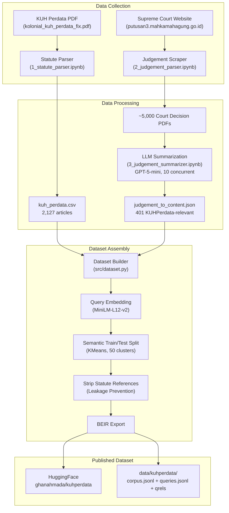
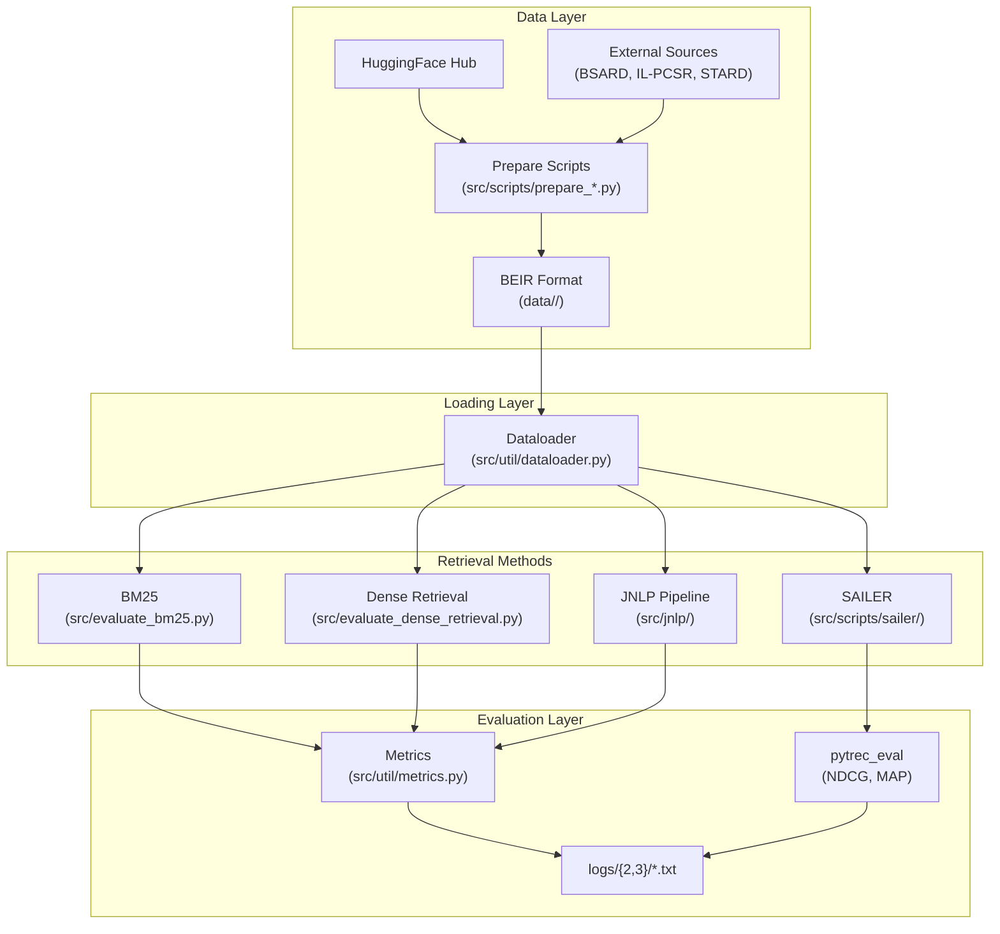
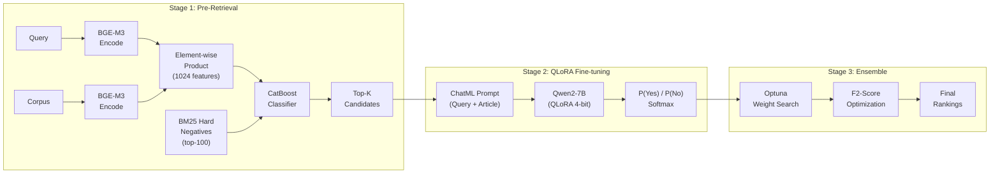

# High Level Design: Multilingual Statute Law Retrieval

| Field | Value |
|-------|-------|
| **Author** | Ghana Ahmada |
| **Repository** | [ghanahmada/kuhperdata](https://huggingface.co/datasets/ghanahmada/kuhperdata) |
| **Version** | 2.0 |
| **Date** | 2026-03-08 |
| **Language** | Python 3.13 |
| **Package Manager** | uv |

---

## 1. Executive Summary

Statute law retrieval — the task of finding relevant legal articles given a natural-language description of a legal situation — remains underserved for non-English languages. While English-centric benchmarks exist (e.g., COLIEE), there is no standardized Indonesian statute retrieval dataset, and cross-lingual comparisons across legal systems are scarce.

This project makes two contributions. **First**, we construct **KUHPerdata**, a novel Indonesian statute law retrieval dataset derived from the *Kitab Undang-Undang Hukum Perdata* (Indonesian Civil Code) and real Supreme Court decisions. It comprises 2,127 statute articles, 1,368 queries, and 4,372 relevance judgments in BEIR format. **Second**, we propose a **language-agnostic retrieval methodology** benchmarked across four datasets spanning Indonesian, French, English, and Chinese legal systems. Our approach adapts the JNLP COLIEE 2025 pipeline — combining BGE-M3 embeddings, CatBoost classification, QLoRA-finetuned LLMs, and Optuna-optimized ensembles — and evaluates whether techniques designed for English/Japanese legal text transfer to typologically diverse languages.

Results show the JNLP pipeline is effective but language-dependent. Stage 1 (BGE-M3 + CatBoost) achieves a 2.7× improvement over BM25 on KUHPerdata (MRR@10: 0.40 vs. 0.15) and 1.3× on BSARD, while Stage 2 (QLoRA-finetuned Qwen2.5-7B) further improves recall (+5.4%). However, the pipeline regresses on IL-PCSR and STARD, revealing sensitivity to query length and corpus scale. SAILER, an English structure-aware legal encoder, proves unsuitable for non-English retrieval even with vocabulary extension — multilingual-e5-base outperforms it by 33× on Indonesian text.

---

## 2. Research Goals

### 2.1 Novel Dataset Construction — KUHPerdata

Build the first Indonesian statute law retrieval dataset grounded in real court decisions:

- **Corpus**: 2,127 articles from the KUH Perdata (Indonesian Civil Code)
- **Queries**: 1,368 legal incident descriptions extracted from Supreme Court decisions via LLM summarization
- **Relevance Judgments**: 4,372 query–article pairs derived from explicit statute citations in court rulings
- **Format**: BEIR-compatible (corpus.jsonl, queries.jsonl, qrels TSVs)
- **Split**: Semantic train/test split via KMeans clustering to minimize topical leakage
- **Leakage Prevention**: Statute references stripped from query text to prevent trivial lookup

### 2.2 Language-Agnostic SOTA Retrieval

Reproduce and extend state-of-the-art retrieval methods across four multilingual statute law datasets:

1. Establish BM25 baselines across all four languages
2. Evaluate dense retrieval (BGE-M3) as a multilingual baseline
3. Adapt the JNLP COLIEE 2025 pipeline (3-stage hybrid) to all datasets
4. Evaluate SAILER (structure-aware pre-trained legal encoder) as an alternative
5. Identify which techniques transfer across languages and which are language-specific

### 2.3 Query Humanization (Planned)

Current queries average ~1,900 characters (LLM-generated summaries of full court decisions). Real judges and lawyers type much shorter queries. A detailed planning document exists at `documentation/PLANNING-HumanizeQuery.md` with a 4-step pipeline:

1. **Fact Extraction** — LLM extracts discrete legal facts guided by relevant articles
2. **Alignment Verification** — Ensure each relevant article has supporting facts
3. **Query Synthesis** — Generate short (~100–200 char) queries in non-professional language
4. **Coverage Check** — Verify all relevant articles still have retrieval signals

Research questions: (RQ1) How much does shortening degrade retrieval? (RQ2) Which methods are robust to short queries? (RQ3) Does fact-aware shortening preserve more quality than naive summarization?

**Status**: Planning complete, implementation pending (~3,000 LLM calls estimated).

---

## 3. Benchmark Datasets

| Property | KUHPerdata | BSARD | IL-PCSR | STARD |
|----------|-----------|-------|---------|-------|
| **Language** | Indonesian (id) | French (fr) | English (en) | Chinese (zh) |
| **Legal System** | Civil (Dutch-derived) | Civil (Belgian) | Common (Indian) | Civil (Chinese) |
| **Corpus Size** | 2,127 | 22,633 | 936 | 55,348 |
| **Queries** | 1,368 | 1,108 | 6,271 | 1,543 |
| **Train / Test** | 1,089 / 279 | 886 / 222 | 5,017 / 1,254 | 1,235 / 308 |
| **Judgments** | 4,372 | 6,845 | 24,317 | 2,717 |
| **Train / Test** | 3,512 / 860 | 5,784 / 1,061 | 19,482 / 4,835 | 2,205 / 512 |
| **Avg Rel/Query** | 3.20 | 6.18 | 3.88 | 1.76 |
| **Source** | Constructed (this work) | Louis et al., 2022 | Parikh et al., 2023 | Li et al., 2023 |
| **Prepare Script** | `prepare_kuhperdata.py` | `prepare_bsard.py` | `prepare_ilpcsr.py` | `prepare_stard.py` |

All datasets are normalized to **BEIR format**:

```
data/<dataset>/
├── corpus.jsonl      # {"_id": "doc_id", "title": "", "text": "..."}
├── queries.jsonl     # {"_id": "query_id", "text": "..."}
├── qrels_train.tsv   # query_id  corpus_id  relevance_score
├── qrels_test.tsv
└── dataset_stats.json
```

All data directories are `.gitignore`d and regenerated from source via prepare scripts (see Section 10).

---

## 4. KUHPerdata Dataset Construction Pipeline



### 4.1 Statute Parsing

**Notebook**: `experiment/1_statute_parser.ipynb`

The `KUHPerdataParser` class extracts structured articles from the colonial-era KUH Perdata PDF using PyMuPDF. It handles the hierarchical structure (Buku → Bab → Bagian → Pasal) and outputs `data/statute/kuh_perdata.csv` with columns: `buku_label`, `buku_judul`, `bab_label`, `bab_judul`, `bagian_label`, `bagian_judul`, `pasal_nomor`, `pasal_text`.

**Result**: 2,127 articles extracted.

### 4.2 Judgement Scraping and Parsing

**Notebook**: `experiment/2_judgement_parser.ipynb`

Court decisions are scraped from `putusan3.mahkamahagung.go.id` using `cloudscraper` (anti-bot bypass). HTML listing pages are parsed for PDF download links, and ~5,000 PDFs are bulk-downloaded from PN Bekasi, PN Denpasar, and PN Jakarta courts.

### 4.3 LLM Summarization

**Notebook**: `experiment/3_judgement_summarizer.ipynb`

Each court decision PDF is processed asynchronously (10 concurrent requests) by GPT-5-mini to extract:
1. Legal incidents described in Bahasa Indonesia
2. Relevant law article citations

Results are filtered for KUHPerdata references. Out of ~5,000 decisions: 223 cite KUHPerdata only, 178 cite both KUHPerdata and KUHP, 15 cite KUHP only, and 4,564 cite neither. The 401 KUHPerdata-relevant decisions form the query basis.

**Output**: `data/judgement/judgement_to_content.json`

### 4.4 Semantic Train/Test Split

**Module**: `src/dataset.py` → `semantic_train_test_split()`

Unlike random splitting, we use **semantic splitting** to ensure train and test queries cover different legal topics:

1. Embed all queries with `paraphrase-multilingual-MiniLM-L12-v2`
2. Cluster into 50 groups via KMeans
3. Greedily assign clusters to train or test, maximizing inter-split cosine distance separation
4. Target: 80/20 split → 1,089 train / 279 test queries

**Split statistics** (from `logs/2/dataset_split_metadata.txt`):
- Unique doc IDs in train: 229
- Unique doc IDs in test: 169
- Doc IDs in both splits: 98
- Test judgments pointing to shared docs: 723/861 (84.0%)
- Separation ratio: 1.08×

### 4.5 Data Leakage Prevention

**Module**: `src/scripts/prepare_kuhperdata.py` → `strip_statute_references()`

Since queries are derived from court decisions that explicitly cite statute articles, the raw query text may contain references like "Pasal 1365 KUHPerdata." These references are stripped via regex to prevent trivial keyword lookup, forcing retrieval methods to understand the legal semantics.

### 4.6 BEIR Export and HuggingFace Upload

The final dataset is exported in BEIR format and uploaded to HuggingFace via `src/scripts/push_kuhperdata.py`. The prepare script (`src/scripts/prepare_kuhperdata.py`) downloads from HuggingFace and regenerates local BEIR files, ensuring reproducibility without committing data to git.

---

## 5. System Architecture



### 5.1 Directory Structure

```
TA/
├── data/                          # All datasets in BEIR format (.gitignored)
│   ├── kuhperdata/                # Primary dataset (Indonesian)
│   ├── bsard/                     # French statute retrieval
│   ├── ilpcsr/                    # English statute retrieval
│   ├── stard/                     # Chinese statute retrieval
│   ├── statute/                   # Raw KUH Perdata PDF + parsed CSV
│   └── judgement/                 # Court decision JSON
├── documentation/                 # Design and planning documents
│   ├── HLD.md                     # This document
│   ├── benchmark-implementation-guide.md
│   └── PLANNING-HumanizeQuery.md  # Query humanization strategy
├── experiment/                    # Jupyter notebooks (data collection pipeline)
│   ├── 1_statute_parser.ipynb
│   ├── 2_judgement_parser.ipynb
│   ├── 3_judgement_summarizer.ipynb
│   ├── 4_bsard_dataset.ipynb
│   ├── 5_ilpcsr_dataset.ipynb
│   ├── 6_stard_dataset.ipynb
│   ├── 7_split_visualization.ipynb
│   ├── judgement_scraper.py
│   └── claude-assistance/         # Auxiliary scraping scripts
├── src/
│   ├── dataset.py                 # KUHPerdata dataset builder
│   ├── evaluate_bm25.py           # BM25 evaluation (all datasets)
│   ├── evaluate_dense_retrieval.py # BGE-M3 cosine similarity
│   ├── evaluate_jnlp.py           # JNLP pipeline entry point
│   ├── jnlp/                      # JNLP 3-stage pipeline
│   │   ├── __init__.py            # Config, constants, base classes
│   │   ├── pipeline.py            # Orchestrator
│   │   ├── stage1_retriever.py    # BGE-M3 + CatBoost
│   │   ├── stage2_finetuner.py    # QLoRA Qwen fine-tuning
│   │   └── stage3_ensemble.py     # Optuna weighted ensemble
│   ├── scripts/
│   │   ├── prepare_kuhperdata.py  # Download + BEIR conversion
│   │   ├── prepare_bsard.py
│   │   ├── prepare_ilpcsr.py
│   │   ├── prepare_stard.py
│   │   ├── push_kuhperdata.py     # Upload to HuggingFace
│   │   └── sailer/                # SAILER fine-tuning + evaluation
│   │       ├── build_finetune_data.py
│   │       ├── build_encode_data.py
│   │       ├── extend_vocab.py    # Indonesian vocab extension for SAILER
│   │       ├── run_finetune.sh
│   │       ├── run_encode.sh
│   │       └── evaluate_retrieval.py
│   └── util/
│       ├── bm25.py                # Custom BM25 implementation
│       ├── dataloader.py          # BEIR format loader
│       └── metrics.py             # MRR, Recall, Precision, Hit Rate
├── logs/                          # Evaluation results
│   ├── 2/                         # BM25, dense retrieval, initial Stage 1
│   └── 3/                         # Cross-dataset Stage 1, Stage 2, SAILER
├── outputs/                       # Model outputs (.gitignored)
├── setup_vm.sh                    # GPU VM one-time setup
├── requirements.txt               # Full dependencies
├── requirements-jnlp.txt         # JNLP-specific deps (Python 3.13)
├── requirements-sailer.txt       # SAILER-specific deps (Python 3.10)
└── pyproject.toml                 # Minimal dependencies (data collection)
```

**Sibling directory**: `../SAILER/` — Full SAILER repository (converted from git submodule to plain code for easier modification).

### 5.2 Key Design Decisions

| Decision | Rationale |
|----------|-----------|
| **BEIR format for all datasets** | Standard IR evaluation format; enables uniform data loading and cross-dataset comparison |
| **Semantic train/test split** | Prevents topical leakage between splits; more realistic evaluation than random split |
| **All data regenerable from scripts** | Data directories are `.gitignored`; `setup_vm.sh` regenerates everything from source |
| **Separate prepare scripts per dataset** | Each external dataset has unique source format; isolation simplifies debugging |
| **JNLP as primary methodology** | Winner of COLIEE 2025; designed for multilingual legal IR; 3-stage design allows ablation |
| **Product features over histogram** | Element-wise product preserves embedding geometry better than binned L1 histograms |
| **BM25 hard negatives** | More informative than random negatives; teaches classifier to distinguish hard cases |
| **Strip statute references** | Prevents data leakage from explicit article citations in court decision text |
| **Dual virtual environments** | SAILER requires Python 3.10; JNLP requires Python 3.13 — separate venvs avoid conflicts |
| **SAILER as plain code** | Converted from git submodule for easier modification (vocab extension, custom fine-tuning) |

---

## 6. Retrieval Methods

### 6.1 BM25 Baseline

**Files**: `src/util/bm25.py`, `src/evaluate_bm25.py`

Custom BM25 implementation built on scikit-learn's `TfidfVectorizer`:

- Parameters: b=0.7, k1=1.6 (tuned from defaults b=0.75, k1=1.5)
- Supports configurable n-gram range
- Chinese tokenization via `jieba` word segmentation
- Evaluated across all 4 datasets with `--dataset` flag

**CLI**:
```bash
python src/evaluate_bm25.py --dataset kuhperdata --top_k 10 --split test
python src/evaluate_bm25.py --dataset stard --top_k 10  # auto jieba for Chinese
```

### 6.2 Dense Retrieval (BGE-M3)

**File**: `src/evaluate_dense_retrieval.py`

Proof-of-concept dense retrieval using `BAAI/bge-m3`:

- Encodes queries and corpus with `BGEM3FlagModel` (1024-dim dense embeddings)
- Cosine similarity scoring
- Evaluates at K = 10, 50, 100
- Includes score distribution analysis and separability index

This serves as both a baseline and the embedding backbone for the JNLP pipeline.

### 6.3 JNLP Pipeline

**Package**: `src/jnlp/`

Adapted from: *"JNLP at COLIEE 2025: Hybrid Large Language Model-based Framework for Legal Information Retrieval and Entailment"*



#### 6.3.1 Stage 1 — BGE-M3 + CatBoost Pre-Retriever

**File**: `src/jnlp/stage1_retriever.py` (579 lines)

Trains a CatBoost binary classifier on query-document pair features:

| Component | Original JNLP Paper | Our Adaptation |
|-----------|---------------------|----------------|
| **Embeddings** | BGE-M3 (1024-dim) | Same |
| **Features** | L1 histogram (76 bins) | Element-wise product (1024 features) |
| **Histogram Range** | Fixed [0, 2] | Calibrated from data |
| **Negatives** | Random | BM25 top-100 hard negatives |
| **Oversampling** | 300× | 10× (sufficient with hard negatives) |
| **Re-ranker** | BGE-reranker-v2-m3 | Optional (BGE-reranker or RankLLaMA) |

**Training Details**:
- Positive pairs: query → relevant articles (from qrels_train)
- Negative pairs: BM25 top-100 per query, excluding positives
- 10× oversampling of positives to balance classes
- CatBoost: 1,000 iterations, GPU-accelerated (~88 seconds)
- Embeddings cached to disk for reuse

#### 6.3.2 Stage 2 — QLoRA Fine-tuned LLM

**File**: `src/jnlp/stage2_finetuner.py`

Binary relevance classification via fine-tuned LLM:

- **Base Models**: Qwen2-7B-Instruct, Qwen2.5-7B-Instruct (default), Qwen3-8B, Qwen3.5-4B
- **Quantization**: 4-bit via Unsloth `FastLanguageModel`
- **LoRA Config**: r=16, alpha=32, target modules: q/k/v/o/gate/up/down projections
- **Prompt Format**: ChatML with system="Legal expert", user="Query: {q}\nArticle: {a}", assistant="Yes"/"No"
- **Hard Negative Mining**: Per query, 4 hard negatives (Stage 1 ranks 1–14) + 1 random negative (ranks 50–99)
- **Training**: 3× positive upsampling, batch_size=8, grad_accum=2 (effective 16), max_seq_length=1536, 1 epoch, lr=2e-4 (cosine)
- **Inference**: Softmax over Yes/No token logits → relevance probability
- **Training time**: ~2h 19m for 988 steps on KUHPerdata (8.47s/step)
- **Inference time**: ~77 min for 279 test queries

#### 6.3.3 Stage 3 — Optuna Weighted Ensemble

**File**: `src/jnlp/stage3_ensemble.py` (233 lines)

Combines multiple Stage 2 model outputs via weighted voting:

- Optuna searches for optimal weights across model predictions
- Optimizes F-beta score with beta=2 (recall-biased, appropriate for legal retrieval)
- Supports arbitrary number of Stage 2 models (different LLMs or checkpoints)

#### 6.3.4 Pipeline Orchestration

**File**: `src/jnlp/pipeline.py` (680 lines)

Key orchestration features:
- `evaluate_stage1_only()` — fast evaluation without LLM inference
- `evaluate_stage2_only()` — full Stage 1+2 with auto-training
- `run_full_pipeline()` — end-to-end training + evaluation
- Smart GPU memory management: Stage 1 models freed before loading Stage 2 LLM
- Embedding caching to disk for repeated evaluations

**CLI**:
```bash
python src/evaluate_jnlp.py --dataset kuhperdata --stage 1 --feature_type product
python src/evaluate_jnlp.py --dataset kuhperdata --stage 2 --llm_model Qwen/Qwen2-7B-Instruct
```

### 6.4 SAILER

**Directory**: `src/scripts/sailer/`

SAILER (Structure-Aware pre-trained language model for legal text retrieval) is evaluated as an alternative dense retrieval approach.

**Pipeline**:
1. `build_finetune_data.py` — Converts KUHPerdata to SAILER format with BM25 hard negatives (30 per query via `rank_bm25.BM25Okapi`)
2. `extend_vocab.py` — Extends SAILER_en tokenizer with 2,232 Indonesian tokens (mean subword initialization)
3. `run_finetune.sh` — Fine-tunes `CSHaitao/SAILER_en` with: q_max_len=512, p_max_len=256, batch_size=4, lr=5e-6, 3 epochs
4. `build_encode_data.py` — Converts corpus and queries to SAILER encoding format
5. `run_encode.sh` — Encodes all texts with fine-tuned model → pickle embeddings
6. `evaluate_retrieval.py` — FAISS IndexFlatIP retrieval (L2-normalized cosine) with `pytrec_eval` metrics (NDCG@10, Recall@10, MAP)

**Results** (KUHPerdata, source: `logs/3/sailer_comparison.txt`):

| Model | NDCG@10 | Recall@10 | MAP | MRR@10 |
|-------|---------|-----------|-----|--------|
| SAILER_en (zero-shot) | ~0.001 | ~0.001 | ~0.001 | ~0.001 |
| SAILER_en + vocab ext. + fine-tune | 0.0045 | 0.0058 | 0.0036 | 0.0104 |
| multilingual-e5-base (fine-tuned) | **0.1490** | **0.2660** | **0.1123** | **0.1603** |

**Conclusion**: SAILER_en is unsuitable for non-English statute retrieval. Vocabulary extension alone cannot overcome English-only pre-training weights. Multilingual-e5-base outperforms by **33×** (NDCG@10: 0.149 vs. 0.0045), confirming that multilingual pre-training is essential for cross-lingual legal IR.

---

## 7. Evaluation Framework

### 7.1 Metrics

| Metric | Description | Implementation |
|--------|-------------|----------------|
| **MRR@K** | Mean Reciprocal Rank at K | `src/util/metrics.py` |
| **Recall@K** | Fraction of relevant docs retrieved in top-K | `src/util/metrics.py` |
| **Precision@K** | Fraction of top-K docs that are relevant | `src/util/metrics.py` |
| **Hit Rate** | Fraction of queries with ≥1 relevant doc in top-K | `src/util/metrics.py` |
| **NDCG@10** | Normalized Discounted Cumulative Gain | `pytrec_eval` (SAILER) |
| **MAP** | Mean Average Precision | `pytrec_eval` (SAILER) |
| **F2-Score** | F-beta with beta=2 (recall-biased) | `src/jnlp/stage3_ensemble.py` |

### 7.2 BM25 Baseline Results (All Datasets)

> Source: `logs/2/bm25.txt`

| Dataset | Language | MRR@10 | Recall@10 | Precision@10 | Hit Rate | N Queries |
|---------|----------|--------|-----------|--------------|----------|-----------|
| **KUHPerdata** | id | 0.1467 | 0.0858 | 0.0316 | 24.06% | 212 |
| **BSARD** | fr | 0.2488 | 0.2664 | 0.0716 | 42.34% | 222 |
| **IL-PCSR** | en | 0.1558 | 0.1017 | 0.0332 | 25.04% | 1,254 |
| **STARD** | zh | 0.3382 | 0.4272 | 0.0643 | 53.25% | 308 |

### 7.3 KUHPerdata Method Comparison

> Sources: `logs/2/`, `logs/3/jnlp_stage1.txt`, `logs/3/jnlp_stage2.txt`, `logs/3/sailer_comparison.txt`

| Method | MRR@10 | Recall@10 | Precision@10 | Hit Rate | Status |
|--------|--------|-----------|--------------|----------|--------|
| BM25 (b=0.7, k1=1.6) | 0.1467 | 0.0858 | 0.0316 | 24.06% | Done |
| BGE-M3 Dense (cosine) | 0.1625 | 0.1300 | 0.0500 | 27.83% | Done |
| me5-base (fine-tuned) | 0.1603 | 0.2660 | — | — | Done |
| SAILER_en + vocab ext. + fine-tune | 0.0104 | 0.0058 | — | — | Done |
| JNLP Stage 1 (product) | **0.3997** | 0.3939 | — | 62.0% | Done |
| JNLP Stage 2 (QLoRA Qwen2.5-7B) | 0.3945 | **0.4151** | — | **64.5%** | Done |
| JNLP Stage 1 + Re-ranker | — | — | — | — | TBD |
| JNLP Stage 3 (Ensemble) | — | — | — | — | TBD |

**Note**: Stage 1 MRR@10 differs between `logs/2/` (0.4681, 212 queries) and `logs/3/` (0.3997, 279 queries) due to different test query counts. The `logs/3/` run uses the full 279 test queries and is the canonical result.

### 7.4 JNLP Stage 1 Cross-Dataset Results

> Source: `logs/3/jnlp_stage1.txt`

| Dataset | Language | N Queries | MRR@10 | Recall@10 | Hit Rate | vs BM25 MRR |
|---------|----------|-----------|--------|-----------|----------|-------------|
| **KUHPerdata** | id | 279 | **0.3997** | 0.3939 | 62.0% | **+173%** |
| **BSARD** | fr | 222 | **0.3284** | 0.3047 | 44.6% | **+32%** |
| **IL-PCSR** | en | 1,254 | 0.0493 | 0.0323 | 12.9% | -68% |
| **STARD** | zh | 308 | 0.2705 | 0.3895 | 49.4% | -20% |

**Key finding**: JNLP Stage 1 excels on small-to-medium corpora (KUHPerdata: 2,127 docs, BSARD: 22,633 docs) but **regresses** on IL-PCSR and STARD. Root causes:

- **IL-PCSR**: Extremely long queries (avg ~3,396 words) cause BGE-M3 to produce generic vectors with near-zero separability. BM25 benefits from raw token overlap. Also, 5,017 train queries over only 936 docs means BM25 top-100 negatives cover 10.7% of the entire corpus, reducing hard negative informativeness.
- **STARD**: Large Chinese corpus (55,348 docs) where BGE-M3 product features don't discriminate well at scale.

### 7.5 Dense Retrieval Detailed Results (KUHPerdata)

> Source: `logs/2/dense_bge_fulldim_cossim.txt`

| K | MRR@K | Recall@K | Precision@K | Hit Rate |
|---|-------|----------|-------------|----------|
| 10 | 0.1625 | 0.1300 | 0.0500 | 27.83% |
| 50 | 0.1703 | 0.2369 | 0.0206 | 46.23% |
| 100 | 0.1714 | 0.3082 | 0.0135 | 54.25% |

**Score Distribution Analysis**:
- Relevant pair mean cosine: 0.5526
- Non-relevant pair mean cosine: 0.4851
- Separability index: 0.5043 (barely above chance)

### 7.6 Stage 2 Detailed Results (KUHPerdata)

> Source: `logs/3/jnlp_stage2.txt`

| Metric | Stage 1 Only | Stage 1 + Stage 2 | Change |
|--------|-------------|-------------------|--------|
| MRR@10 | 0.3997 | 0.3945 | -0.005 (-0.1%) |
| Recall@10 | 0.3939 | 0.4151 | +0.021 (+5.4%) |
| Hit Rate | 62.0% | 64.5% | +2.5% |

**Configuration**: Qwen2.5-7B-Instruct, 4-bit QLoRA via Unsloth, hard negative mining (4 hard + 1 random per query), 1 epoch, 988 training steps.

**Interpretation**: MRR@10 slightly drops but Recall@10 improves significantly. Stage 2 trades top-1 precision for broader recall — appropriate for legal retrieval where missing a relevant article is more costly than imprecise ranking.

### 7.7 Evaluation Protocol

| Protocol | Detail |
|----------|--------|
| **Evaluation split** | Test only (no validation on test during development) |
| **Split method** | Semantic (KMeans clustering), not random |
| **Leakage prevention** | Statute references stripped from queries |
| **Random seed** | 42 (fixed for reproducibility) |
| **Metrics computed** | Per-query, then averaged (macro) |

---

## 8. Research Findings and Open Questions

### 8.1 BM25 Struggles with Legal Text

BM25 achieves only MRR@10 = 0.15 on KUHPerdata (and similarly on IL-PCSR at 0.16). Legal statutes use formal, archaic language that diverges significantly from how legal situations are described in court decisions. Term overlap between queries and relevant articles is low.

STARD performs notably better (MRR@10 = 0.34), possibly because Chinese statute text has higher lexical overlap with case descriptions, or because STARD's avg 1.76 relevant docs/query makes the task inherently easier.

### 8.2 Dense Retrieval Marginal Over BM25

Raw BGE-M3 cosine retrieval improves only marginally over BM25 on KUHPerdata (+0.016 MRR, +0.044 Recall@10). The separability index of 0.50 suggests embeddings alone cannot distinguish relevant from non-relevant pairs — the cosine similarity distributions overlap almost entirely.

### 8.3 JNLP Stage 1: Effective but Language-Dependent

The CatBoost classifier over product features achieves MRR@10 = 0.40 on KUHPerdata, a **2.7× improvement over BM25**. However, cross-dataset evaluation reveals this is **not universal**:

- **Works well**: KUHPerdata (+173% vs BM25), BSARD (+32%)
- **Regresses**: IL-PCSR (-68%), STARD (-20%)

This suggests element-wise product features and BM25 hard negatives are most effective when: (a) queries are moderate length, (b) corpus is small-to-medium, and (c) BGE-M3 embeddings have sufficient separability. When queries are extremely long (IL-PCSR) or the corpus is very large (STARD), the approach breaks down.

### 8.4 Stage 2 Improves Recall at Cost of MRR

QLoRA-finetuned Qwen2.5-7B on KUHPerdata shows a recall-precision tradeoff: MRR@10 drops marginally (-0.1%) while Recall@10 improves meaningfully (+5.4%). This is desirable for legal retrieval where coverage matters more than top-1 precision.

### 8.5 SAILER Fails Cross-Lingually

SAILER_en with vocabulary extension (2,232 Indonesian tokens) and fine-tuning achieves only NDCG@10 = 0.0045 on KUHPerdata — **33× worse** than multilingual-e5-base. English pre-training weights dominate despite tokenization extension, confirming that multilingual pre-training (not just multilingual tokenization) is essential for cross-lingual legal IR.

### 8.6 Answered Questions

| Question | Answer |
|----------|--------|
| Does Stage 1 transfer across datasets? | Partially — works on KUHPerdata and BSARD, regresses on IL-PCSR and STARD |
| Can Stage 2 improve Stage 1? | Yes, +5.4% Recall@10 on KUHPerdata (minor MRR trade-off) |
| Does SAILER complement BGE-M3? | No — SAILER is unsuitable for non-English legal text |

### 8.7 Open Questions

- **IL-PCSR/STARD remediation**: Can query truncation, corpus chunking, or alternative negative sampling fix the regressions?
- **Stage 2 on other datasets**: Will QLoRA improve recall on BSARD, IL-PCSR, STARD similarly?
- **Stage 3 ensemble**: Can combining multiple Stage 2 models (Qwen2, Qwen2.5, Qwen3) push F2 further?
- **Feature type ablation**: How does product feature performance compare to histogram across languages?
- **Query humanization impact**: Does shortening queries to realistic lengths change which methods are best?

---

## 9. Infrastructure and Reproducibility

### 9.1 Environment

| Component | Version/Tool |
|-----------|-------------|
| **Python (JNLP)** | 3.13 (`.venv-jnlp`) |
| **Python (SAILER)** | 3.10 (`.venv-sailer`) |
| **Package Manager** | uv |
| **GPU Setup** | `setup_vm.sh` (one-time VM provisioning) |
| **Random Seed** | 42 |

### 9.2 Key Dependencies

| Category | Packages |
|----------|----------|
| **Data Processing** | PyMuPDF, pandas, beautifulsoup4, cloudscraper, tqdm |
| **LLM APIs** | mistralai, openai, python-dotenv |
| **ML Core** | scikit-learn, jieba, datasets |
| **JNLP Pipeline** | torch, transformers (<5.0), sentence-transformers, accelerate, peft, bitsandbytes, FlagEmbedding, catboost, imbalanced-learn, optuna |
| **SAILER** | rank-bm25, pytrec-eval-terrier, faiss (1.7.3) |
| **Unsloth** | unsloth (QLoRA 4-bit quantization) |

### 9.3 VM Setup and Data Regeneration

The `setup_vm.sh` script performs complete environment setup with **two separate virtual environments**:

1. Clones the SAILER repository as a sibling directory (`../SAILER/`)
2. Creates `.venv-sailer` (Python 3.10) — data preparation + SAILER fine-tuning
3. Creates `.venv-jnlp` (Python 3.13) — JNLP pipeline evaluation
4. Installs dependencies from `requirements-sailer.txt` and `requirements-jnlp.txt` respectively
5. Regenerates all 4 datasets via prepare scripts:
   - `python src/scripts/prepare_kuhperdata.py`
   - `python src/scripts/prepare_bsard.py`
   - `python src/scripts/prepare_ilpcsr.py`
   - `python src/scripts/prepare_stard.py`
6. Builds SAILER fine-tuning and encoding data

All data can be regenerated from scratch — no data files need to be committed to git.

---

## 10. Appendix

### 10.1 CLI Reference

| Command | Description |
|---------|-------------|
| `python src/evaluate_bm25.py --dataset <name> --top_k 10` | Run BM25 evaluation |
| `python src/evaluate_dense_retrieval.py` | Run BGE-M3 dense retrieval on KUHPerdata |
| `python src/evaluate_jnlp.py --dataset <name> --stage 1 --feature_type product` | JNLP Stage 1 only |
| `python src/evaluate_jnlp.py --dataset <name> --stage 2 --llm_model qwen2.5` | JNLP Stage 1+2 |
| `python src/scripts/prepare_kuhperdata.py` | Regenerate KUHPerdata from HuggingFace |
| `python src/scripts/prepare_bsard.py` | Regenerate BSARD |
| `python src/scripts/prepare_ilpcsr.py` | Regenerate IL-PCSR |
| `python src/scripts/prepare_stard.py` | Regenerate STARD |
| `python src/scripts/sailer/extend_vocab.py` | Extend SAILER tokenizer with Indonesian tokens |
| `python src/scripts/sailer/build_finetune_data.py` | Build SAILER fine-tuning data |
| `python src/scripts/sailer/build_encode_data.py` | Build SAILER encoding data |
| `bash src/scripts/sailer/run_finetune.sh` | Fine-tune SAILER model |
| `bash src/scripts/sailer/run_encode.sh` | Encode with fine-tuned SAILER |
| `python src/scripts/sailer/evaluate_retrieval.py` | Evaluate SAILER retrieval |
| `python src/scripts/push_kuhperdata.py` | Upload KUHPerdata to HuggingFace |
| `bash setup_vm.sh` | Full VM setup (one-time) |

### 10.2 BM25 CLI Options

| Flag | Default | Description |
|------|---------|-------------|
| `--dataset` | `kuhperdata` | Dataset name (`kuhperdata`, `bsard`, `ilpcsr`, `stard`) |
| `--split` | `test` | Evaluation split |
| `--top_k` | `10` | Number of top documents to retrieve |
| `--bm25_b` | `0.75` | BM25 b parameter (document length normalization) |
| `--bm25_k1` | `1.5` | BM25 k1 parameter (term frequency saturation) |
| `--n_gram` | `(1, 1)` | N-gram range for TF-IDF |
| `--verbose` | `False` | Show per-query results |

### 10.3 JNLP CLI Options

| Flag | Default | Description |
|------|---------|-------------|
| `--dataset` | `kuhperdata` | Dataset name |
| `--stage` | `1` | Pipeline stage (1, 2, or 3) |
| `--feature_type` | `product` | Feature extraction (`product` or `histogram`) |
| `--llm_model` | `qwen2.5` | LLM shorthand: `qwen2`, `qwen2.5`, `qwen3`, `qwen3.5` |
| `--no-reranker` | `False` | Disable re-ranker in Stage 1 |

### 10.4 Model Cards

| Model | HuggingFace ID | Usage |
|-------|---------------|-------|
| **BGE-M3** | `BAAI/bge-m3` | Multilingual embeddings (1024-dim) for JNLP Stage 1 and dense retrieval |
| **BGE Reranker v2 M3** | `BAAI/bge-reranker-v2-m3` | Optional re-ranker in JNLP Stage 1 |
| **RankLLaMA** | `castorini/rankllama-v1-7b-lora-passage` | Alternative re-ranker |
| **Qwen2-7B-Instruct** | `Qwen/Qwen2-7B-Instruct` | LLM for JNLP Stage 2 |
| **Qwen2.5-7B-Instruct** | `Qwen/Qwen2.5-7B-Instruct` | Default LLM for JNLP Stage 2 |
| **Qwen3-8B** | `Qwen/Qwen3-8B` | Alternative LLM for Stage 2 |
| **Qwen3.5-4B** | `Qwen/Qwen3.5-4B` | Lightweight alternative LLM for Stage 2 |
| **multilingual-e5-base** | `intfloat/multilingual-e5-base` | Multilingual dense retrieval (SAILER comparison baseline) |
| **SAILER_en** | `CSHaitao/SAILER_en` | Structure-aware legal encoder (unsuitable for non-English) |
| **MiniLM** | `paraphrase-multilingual-MiniLM-L12-v2` | Query embedding for semantic splitting |
